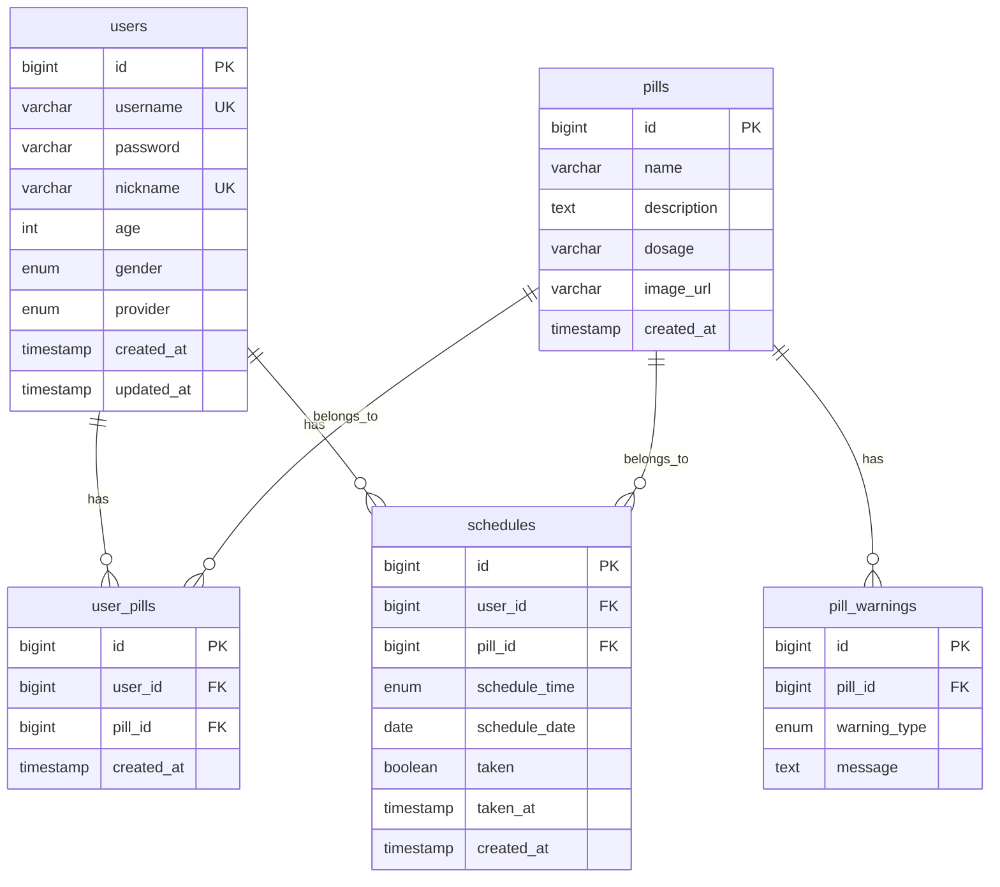

# Time To Pill

복약 관리 애플리케이션 - React Native + Spring Boot

## Features

- 회원가입/로그인 (일반 로그인, Google OAuth)
- 약 검색 및 등록
- 복약 스케줄 관리 (아침/점심/저녁)
- 복약 알림 설정
- 복약 통계 확인
- 마이페이지 (프로필, 설정)

## Screenshots

| 로그인 | 홈 | 검색 | 마이페이지 |
|--------|-----|------|-----------|
| 로그인/회원가입 | 복약 현황 | 약 검색 | 설정 |

## Tech Stack

| Layer | Technology |
|-------|------------|
| Frontend | React Native, Expo, TypeScript |
| Backend | Spring Boot 3.x, Java 21 |
| Database | MySQL 8.0 |
| Auth | JWT, Google OAuth |

---

## Requirements

| Tool | Version | Check Command |
|------|---------|---------------|
| Node.js | 18.x+ | `node --version` |
| npm | 9.x+ | `npm --version` |
| Java JDK | 21 | `java --version` |
| MySQL | 8.0 | `mysql --version` |
| Android Studio | Latest | - |

---

## Project Structure

```
TimeToPill/
├── app/                          # Frontend (React Native + Expo)
│   └── src/
│       ├── screens/              # UI screens
│       │   ├── LoginScreen.tsx
│       │   ├── RegisterScreen.tsx
│       │   ├── HomeScreen.tsx
│       │   ├── SearchScreen.tsx
│       │   ├── MyPageScreen.tsx
│       │   ├── NotificationSettingsScreen.tsx
│       │   ├── ChangePasswordScreen.tsx
│       │   ├── StatisticsScreen.tsx
│       │   ├── HelpScreen.tsx
│       │   └── AppInfoScreen.tsx
│       ├── services/             # API calls
│       ├── types/                # TypeScript types
│       ├── navigation/           # Navigation config
│       └── utils/                # Utilities and constants
│
├── backend/                      # Backend (Spring Boot)
│   └── src/main/java/com/timetopill/
│       ├── controller/           # REST API endpoints
│       ├── service/              # Business logic
│       ├── repository/           # Data access layer
│       ├── entity/               # JPA entities
│       ├── dto/                  # Request/Response objects
│       └── config/               # Configuration
│
├── database/                     # Database
│   ├── DATABASE_SPEC.md          # Table specifications
│   ├── migrations/               # SQL migration files
│   └── README.md                 # Database collaboration guide
│
└── README.md
```

---

## Getting Started

### 1. Clone Repository

```bash
git clone https://github.com/your-username/TimeToPill.git
cd TimeToPill
```

### 2. Database Setup

```bash
# MySQL 접속
mysql -u root -p

# 데이터베이스 생성 및 스키마 적용
CREATE DATABASE timetopill;
USE timetopill;
SOURCE database/migrations/V001_init_schema.sql;
SOURCE database/migrations/V002_create_pills_table.sql;
SOURCE database/migrations/V003_create_pill_warnings_table.sql;
SOURCE database/migrations/V004_create_user_pills_table.sql;
SOURCE database/migrations/V005_create_schedules_table.sql;
SOURCE database/migrations/V006_add_provider_column.sql;
```

### 3. Backend Setup

```bash
cd backend

# 환경변수 설정 (Windows PowerShell)
$env:DB_PASSWORD="your_mysql_password"

# 실행
./gradlew bootRun
```

서버 주소: `http://localhost:8080`

### 4. Frontend Setup

```bash
cd app

# 의존성 설치
npm install

# Expo 개발 서버 시작
npm start

# 또는 Android 직접 실행
npm run android
```

---

## Database Schema



---

## API Endpoints

### Auth
| Method | Endpoint | Description |
|--------|----------|-------------|
| POST | `/api/auth/register` | 회원가입 |
| POST | `/api/auth/login` | 로그인 |
| POST | `/api/auth/google` | Google OAuth 로그인 |
| GET | `/api/auth/check-nickname` | 닉네임 중복 확인 |
| PUT | `/api/auth/password` | 비밀번호 변경 |

### Pills
| Method | Endpoint | Description |
|--------|----------|-------------|
| GET | `/api/pills/search` | 약 이름으로 검색 |
| GET | `/api/pills/search/symptom` | 증상으로 검색 |
| GET | `/api/pills/{id}` | 약 상세 정보 |
| GET | `/api/pills/my` | 내 약 목록 |
| POST | `/api/pills/my/{id}` | 약 추가 |
| DELETE | `/api/pills/my/{id}` | 약 삭제 |

### Schedule
| Method | Endpoint | Description |
|--------|----------|-------------|
| GET | `/api/schedule/today` | 오늘의 복약 스케줄 |
| PUT | `/api/schedule/{id}/taken` | 복용 완료 처리 |

---

## Environment Variables

| Variable | Default | Description |
|----------|---------|-------------|
| `DB_HOST` | localhost | 데이터베이스 호스트 |
| `DB_PORT` | 3306 | 데이터베이스 포트 |
| `DB_NAME` | timetopill | 데이터베이스 이름 |
| `DB_USERNAME` | root | 데이터베이스 사용자 |
| `DB_PASSWORD` | - | 데이터베이스 비밀번호 |

---

## Troubleshooting

### MySQL 연결 실패
1. MySQL 서버 실행 확인
2. `DB_PASSWORD` 환경변수 확인
3. `timetopill` 데이터베이스 존재 확인

### 앱에서 API 연결 실패
- Android 에뮬레이터에서는 `localhost` 대신 `10.0.2.2` 사용
- `app/src/services/api.ts` 확인

### Gradle 빌드 오류
```bash
cd backend
./gradlew clean build --refresh-dependencies
```

---

## License

MIT License
