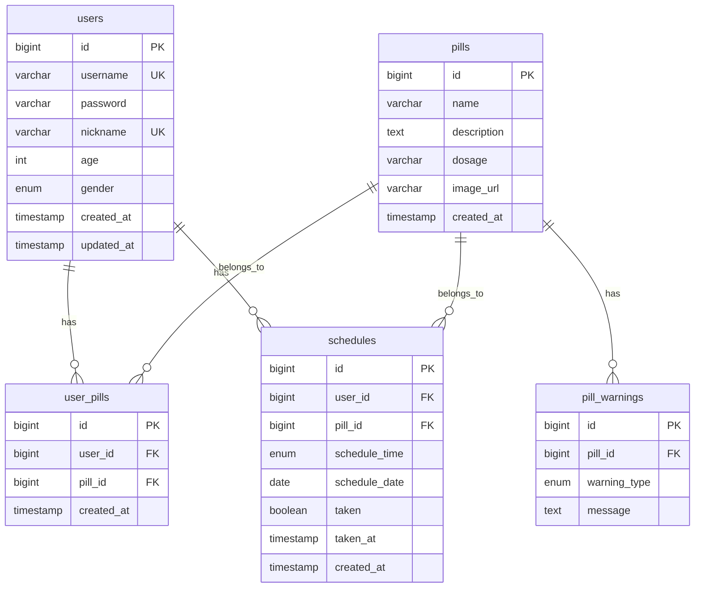

# TimeToPill

A medication management application built with React Native and Spring Boot.

---

## Requirements

| Tool | Version | Check Command |
|------|---------|---------------|
| Node.js | 18.x+ | `node --version` |
| npm | 9.x+ | `npm --version` |
| Java JDK | 21 | `java --version` |
| MySQL | 8.0 | `mysql --version` |
| Android Studio | Latest | - |

---

## Project Structure

```
TimeToPill/
├── app/                        # Frontend (React Native + Expo)
│   └── src/
│       ├── screens/            # UI screens
│       ├── services/           # API calls
│       ├── types/              # TypeScript types
│       ├── navigation/         # Navigation config
│       └── utils/              # Utilities and constants
│
├── backend/                    # Backend (Spring Boot)
│   └── src/main/java/com/timetopill/
│       ├── controller/         # REST API endpoints
│       ├── service/            # Business logic
│       ├── repository/         # Data access layer
│       ├── entity/             # JPA entities
│       ├── dto/                # Request/Response objects
│       └── config/             # Configuration
│
├── database/                   # Database
│   ├── DATABASE_SPEC.md        # Table specifications
│   ├── migrations/             # SQL migration files
│   └── README.md               # Database collaboration guide
│
└── README.md
```

---

## Database Schema



---

## Team Roles

| Role | Folder | Description |
|------|--------|-------------|
| Frontend | `app/` | React Native app development |
| Backend | `backend/` | Spring Boot API development |
| Database | `database/` | MySQL schema design |

---

## Getting Started

### 1. Clone Repository

```bash
git clone {REPOSITORY_URL}
cd TimeToPill
```

### 2. Database Setup

```sql
-- Connect to MySQL
mysql -u root -p

-- Create database and run schema
CREATE DATABASE timetopill;
USE timetopill;
SOURCE database/migrations/V001_init_schema.sql;
```

### 3. Backend Setup

```bash
cd backend

# Set environment variables (Windows PowerShell)
$env:DB_PASSWORD="your_mysql_password"

# Run
./gradlew bootRun
```

Or in IntelliJ:
1. Open `backend/` folder
2. Run > Edit Configurations > Environment Variables
3. Add `DB_PASSWORD=your_password`

### 4. Frontend Setup

```bash
cd app

# Install dependencies
npm install

# Start Android emulator, then run
npm run android
```

---

## Environment Variables

| Variable | Default | Description |
|----------|---------|-------------|
| `DB_HOST` | localhost | Database host |
| `DB_PORT` | 3306 | Database port |
| `DB_NAME` | timetopill | Database name |
| `DB_USERNAME` | root | Database username |
| `DB_PASSWORD` | - | Database password |

---

## API Endpoints

| Method | Endpoint | Description |
|--------|----------|-------------|
| POST | `/api/auth/register` | User registration |
| POST | `/api/auth/login` | User login |
| GET | `/api/auth/check-nickname` | Check nickname availability |
| GET | `/api/pills/search` | Search pills by name |
| GET | `/api/pills/{id}` | Get pill details |
| GET | `/api/pills/my` | Get user's pill list |
| POST | `/api/pills/my/{id}` | Add pill to user's list |
| DELETE | `/api/pills/my/{id}` | Remove pill from user's list |
| GET | `/api/schedule/today` | Get today's schedule |
| PUT | `/api/schedule/{id}/taken` | Mark as taken |

---

## Branch Strategy

```
main
└── develop
    ├── feature/{feature-name}
    ├── fix/{bug-name}
    └── refactor/{target}
```

## Commit Convention

```
feat: Add new feature
fix: Bug fix
docs: Documentation update
style: Code formatting
refactor: Code refactoring
```

---

## Troubleshooting

### MySQL Connection Failed
1. Check if MySQL server is running
2. Verify `DB_PASSWORD` environment variable
3. Confirm `timetopill` database exists

### API Connection Failed in App
- Use `10.0.2.2` instead of `localhost` in Android emulator
- Check `app/src/services/api.ts`

### Gradle Build Error
```bash
cd backend
./gradlew clean build --refresh-dependencies
```
