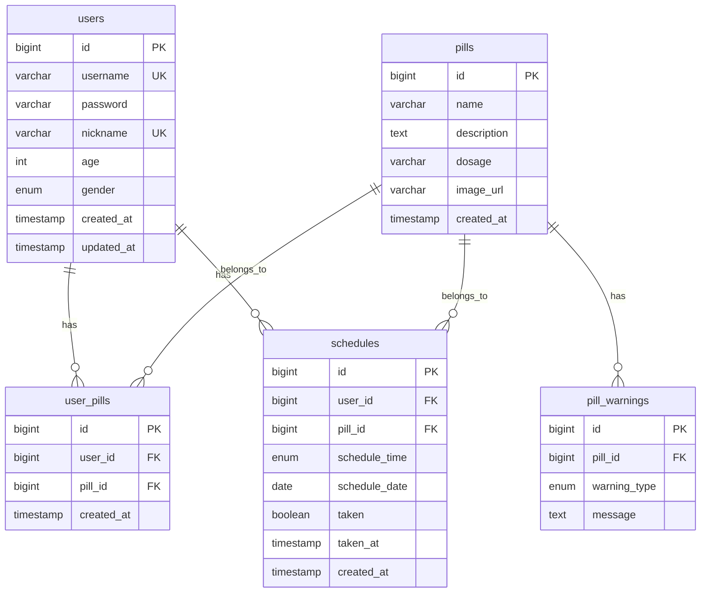

# TimeToPill Database Specification

## Initial Setup

```sql
CREATE DATABASE timetopill;
USE timetopill;
```

---

## Table Structure

### 1. users

| Column | Type | Constraints | Description |
|--------|------|-------------|-------------|
| id | BIGINT | PK, AUTO_INCREMENT | Primary key |
| username | VARCHAR(50) | UNIQUE, NOT NULL | Login ID (or email for OAuth) |
| password | VARCHAR(255) | | Password (hashed, NULL for OAuth) |
| nickname | VARCHAR(50) | UNIQUE, NOT NULL | Display name |
| age | INT | | User age |
| gender | ENUM('M','F') | | Gender |
| provider | VARCHAR(10) | DEFAULT 'LOCAL' | Auth provider (LOCAL, GOOGLE) |
| created_at | TIMESTAMP | | Created timestamp |
| updated_at | TIMESTAMP | | Updated timestamp |

---

### 2. pills

| Column | Type | Constraints | Description |
|--------|------|-------------|-------------|
| id | BIGINT | PK, AUTO_INCREMENT | Primary key |
| name | VARCHAR(100) | NOT NULL | Pill name |
| description | TEXT | | Description |
| dosage | VARCHAR(50) | | Dosage info |
| image_url | VARCHAR(500) | | Image URL |
| created_at | TIMESTAMP | | Created timestamp |

---

### 3. pill_warnings

| Column | Type | Constraints | Description |
|--------|------|-------------|-------------|
| id | BIGINT | PK, AUTO_INCREMENT | Primary key |
| pill_id | BIGINT | FK -> pills.id | Reference to pill |
| warning_type | ENUM | NOT NULL | drowsiness, interaction, pregnancy, alcohol |
| message | TEXT | | Warning message |

---

### 4. user_pills

| Column | Type | Constraints | Description |
|--------|------|-------------|-------------|
| id | BIGINT | PK, AUTO_INCREMENT | Primary key |
| user_id | BIGINT | FK -> users.id | Reference to user |
| pill_id | BIGINT | FK -> pills.id | Reference to pill |
| created_at | TIMESTAMP | | Added timestamp |

**Constraint:** UNIQUE (user_id, pill_id)

---

### 5. schedules

| Column | Type | Constraints | Description |
|--------|------|-------------|-------------|
| id | BIGINT | PK, AUTO_INCREMENT | Primary key |
| user_id | BIGINT | FK -> users.id | Reference to user |
| pill_id | BIGINT | FK -> pills.id | Reference to pill |
| schedule_time | ENUM | NOT NULL | morning, afternoon, evening |
| schedule_date | DATE | NOT NULL | Scheduled date |
| taken | BOOLEAN | DEFAULT FALSE | Taken status |
| taken_at | TIMESTAMP | | Taken timestamp |
| created_at | TIMESTAMP | | Created timestamp |

---

## ERD Diagram



---

## Notes

- Use snake_case for table and column names
- Apply CASCADE on FK delete
- Timezone: Asia/Seoul
