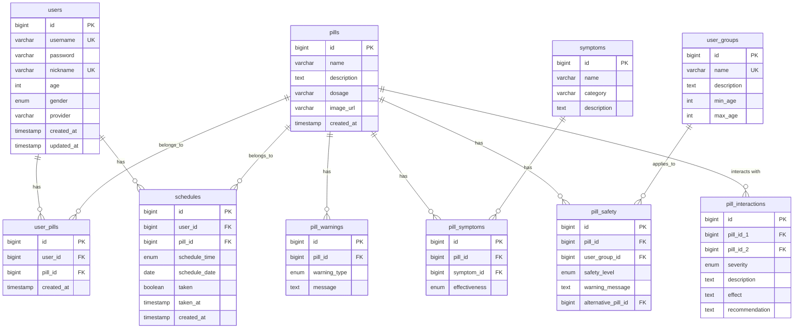

# TimeToPill Database Specification

## Initial Setup

```sql
CREATE DATABASE timetopill;
USE timetopill;
```

---

## Table Structure

### Status Legend
- **CONFIRMED** - Structure finalized, ready for use
- **SKELETON** - Basic structure, team member to complete

---

### 1. users (CONFIRMED)

| Column | Type | Constraints | Description |
|--------|------|-------------|-------------|
| id | BIGINT | PK, AUTO_INCREMENT | Primary key |
| username | VARCHAR(50) | UNIQUE, NOT NULL | Login ID (or email for OAuth) |
| password | VARCHAR(255) | | Password (hashed, NULL for OAuth) |
| nickname | VARCHAR(50) | UNIQUE, NOT NULL | Display name |
| age | INT | | User age |
| gender | ENUM('M','F') | | Gender |
| provider | VARCHAR(10) | DEFAULT 'LOCAL' | Auth provider (LOCAL, GOOGLE) |
| created_at | TIMESTAMP | | Created timestamp |
| updated_at | TIMESTAMP | | Updated timestamp |

---

### 2. pills (CONFIRMED)

| Column | Type | Constraints | Description |
|--------|------|-------------|-------------|
| id | BIGINT | PK, AUTO_INCREMENT | Primary key |
| name | VARCHAR(100) | NOT NULL | Pill name |
| description | TEXT | | Description |
| dosage | VARCHAR(50) | | Dosage info |
| image_url | VARCHAR(500) | | Image URL |
| created_at | TIMESTAMP | | Created timestamp |

---

### 3. pill_warnings (CONFIRMED)

| Column | Type | Constraints | Description |
|--------|------|-------------|-------------|
| id | BIGINT | PK, AUTO_INCREMENT | Primary key |
| pill_id | BIGINT | FK -> pills.id | Reference to pill |
| warning_type | ENUM | NOT NULL | drowsiness, interaction, pregnancy, alcohol |
| message | TEXT | | Warning message |

---

### 4. user_pills (CONFIRMED)

| Column | Type | Constraints | Description |
|--------|------|-------------|-------------|
| id | BIGINT | PK, AUTO_INCREMENT | Primary key |
| user_id | BIGINT | FK -> users.id | Reference to user |
| pill_id | BIGINT | FK -> pills.id | Reference to pill |
| created_at | TIMESTAMP | | Added timestamp |

**Constraint:** UNIQUE (user_id, pill_id)

---

### 5. schedules (CONFIRMED)

| Column | Type | Constraints | Description |
|--------|------|-------------|-------------|
| id | BIGINT | PK, AUTO_INCREMENT | Primary key |
| user_id | BIGINT | FK -> users.id | Reference to user |
| pill_id | BIGINT | FK -> pills.id | Reference to pill |
| schedule_time | ENUM | NOT NULL | morning, afternoon, evening |
| schedule_date | DATE | NOT NULL | Scheduled date |
| taken | BOOLEAN | DEFAULT FALSE | Taken status |
| taken_at | TIMESTAMP | | Taken timestamp |
| created_at | TIMESTAMP | | Created timestamp |

---

### 6. symptoms (SKELETON)

| Column | Type | Constraints | Description |
|--------|------|-------------|-------------|
| id | BIGINT | PK, AUTO_INCREMENT | Primary key |
| name | VARCHAR(100) | NOT NULL | Symptom name (headache, fever, etc.) |
| category | VARCHAR(50) | | Category (pain, respiratory, etc.) |
| description | TEXT | | Description |
| created_at | TIMESTAMP | | Created timestamp |

---

### 7. pill_symptoms (SKELETON)

| Column | Type | Constraints | Description |
|--------|------|-------------|-------------|
| id | BIGINT | PK, AUTO_INCREMENT | Primary key |
| pill_id | BIGINT | FK -> pills.id | Reference to pill |
| symptom_id | BIGINT | FK -> symptoms.id | Reference to symptom |
| effectiveness | ENUM | | high, medium, low |

**Constraint:** UNIQUE (pill_id, symptom_id)

---

### 8. user_groups (SKELETON)

| Column | Type | Constraints | Description |
|--------|------|-------------|-------------|
| id | BIGINT | PK, AUTO_INCREMENT | Primary key |
| name | VARCHAR(50) | UNIQUE, NOT NULL | Group name (pregnant, elderly, children) |
| description | TEXT | | Description |
| min_age | INT | | Minimum age for group |
| max_age | INT | | Maximum age for group |

**Default values:** pregnant, breastfeeding, elderly, children, infants

---

### 9. pill_safety (SKELETON)

| Column | Type | Constraints | Description |
|--------|------|-------------|-------------|
| id | BIGINT | PK, AUTO_INCREMENT | Primary key |
| pill_id | BIGINT | FK -> pills.id | Reference to pill |
| user_group_id | BIGINT | FK -> user_groups.id | Reference to user group |
| safety_level | ENUM | NOT NULL | safe, caution, avoid, prohibited |
| warning_message | TEXT | | Warning for this group |
| alternative_pill_id | BIGINT | FK -> pills.id | Alternative pill suggestion |

**Constraint:** UNIQUE (pill_id, user_group_id)

---

### 10. pill_interactions (SKELETON)

| Column | Type | Constraints | Description |
|--------|------|-------------|-------------|
| id | BIGINT | PK, AUTO_INCREMENT | Primary key |
| pill_id_1 | BIGINT | FK -> pills.id | First pill |
| pill_id_2 | BIGINT | FK -> pills.id | Second pill |
| severity | ENUM | NOT NULL | minor, moderate, major, contraindicated |
| description | TEXT | | Interaction description |
| effect | TEXT | | What happens when taken together |
| recommendation | TEXT | | Suggested action |
| created_at | TIMESTAMP | | Created timestamp |

**Constraint:** UNIQUE (pill_id_1, pill_id_2), CHECK (pill_id_1 < pill_id_2)

---

## ERD Diagram



---

## Migration Files

| File | Status | Description |
|------|--------|-------------|
| V001_init_schema.sql | CONFIRMED | users, pills, pill_warnings, user_pills, schedules |
| V002_example_add_column.sql | EXAMPLE | Example migration template |
| V003_add_provider_column.sql | CONFIRMED | Add OAuth provider column to users |
| V004_create_symptoms_table.sql | SKELETON | Symptoms and pill-symptom tables |
| V005_create_safety_table.sql | SKELETON | User groups and pill safety tables |
| V006_create_interaction_table.sql | SKELETON | Drug interaction table |

---

## Notes

- Use snake_case for table and column names
- Apply CASCADE on FK delete
- Timezone: Asia/Seoul
- Team members: Update SKELETON tables and change status to CONFIRMED when complete
